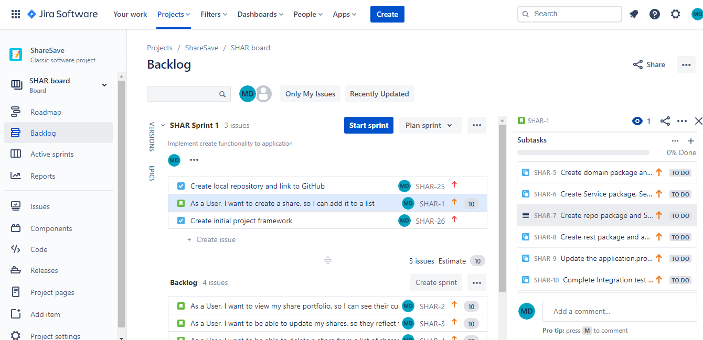
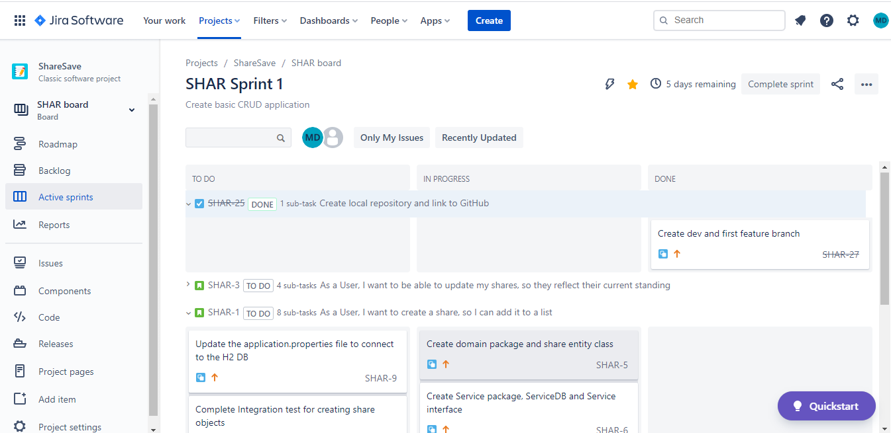
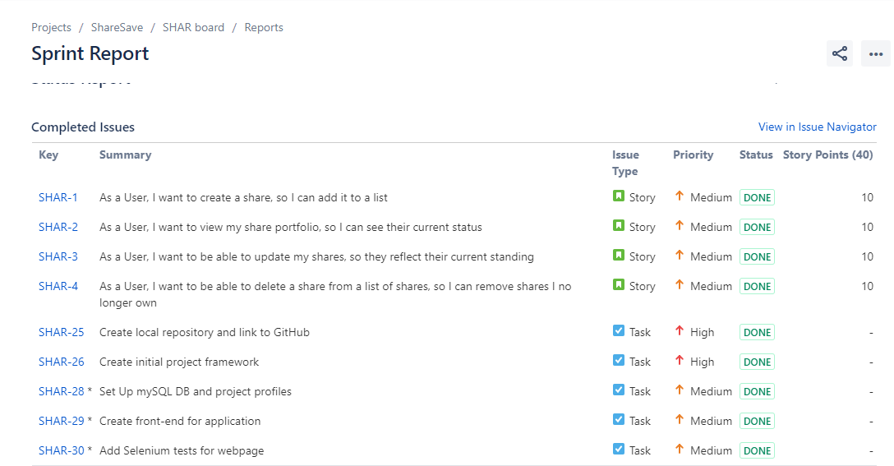
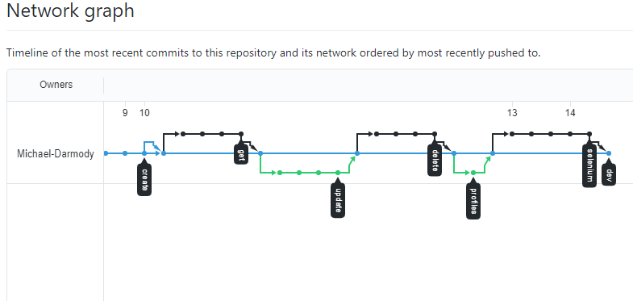
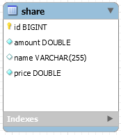
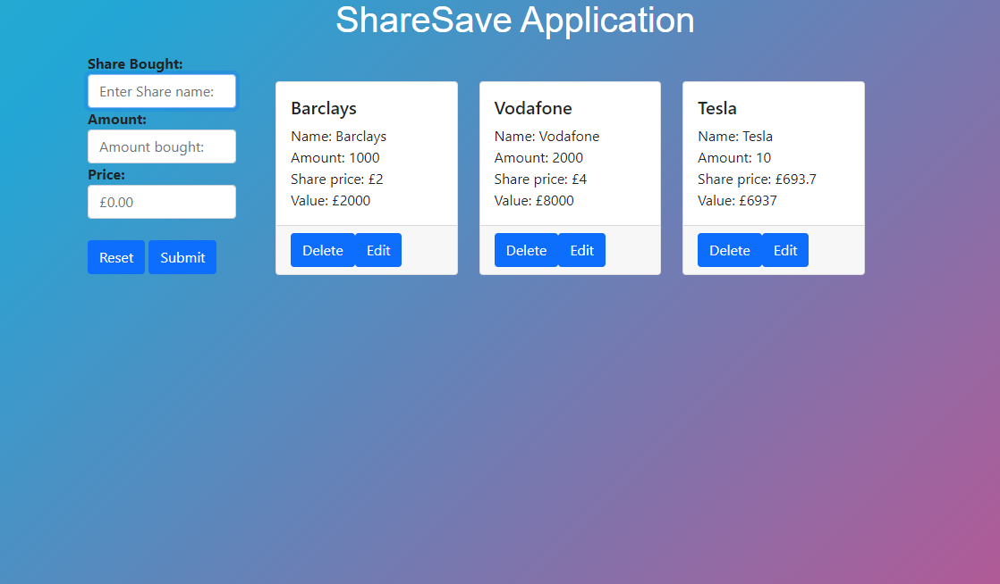
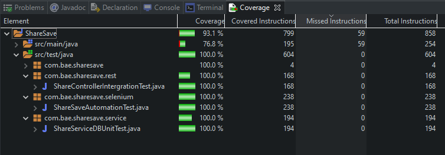

# Share-Save-FE

<h2 align="center">Quick Links</h2>

[My Approach](#My-Approach) |  [Jira Board](#Jira-Board) | [GitHub](#Version-Control) | [Front-End](#Front-End) | [Back-End](#Back-End) | [Reflection](#Future-Improvements/Reflection) | [Author](#Author-&-Acknowledgements)

## Introduction
ShareSave is a basic CRUD (Create, Read, Update, Delete) application that can be used to manage and track shares purchased. This was my first project at QA Academy and incorporates full stack development, HTML, CSS & Javascript in the front-end, the back-end was comprised of Spring and H2/MySQL to manage Database interactions.

## Project Brief
The overall objective for this project was the following:

- To create a CRUD application with the utilisation of supporting tools, methodologies and technologies that encapsulate  all core modules covered during training.

### Scope
- A Jira board with full expansion on user stories, use cases and tasks needed to complete the project. This can be found here
- Clear Documentation from a design phase describing the architecture used for the project.
- A relational database used to store data persistently for the project.
- A functional application created in the OOP language, following best practices and design principles covered during training, this application needs to meet the requirements set on the Kanban Board.
- The application must have a functioning front-end website and integrated API.
- Fully designed test suites for the application you are creating, as well as automated tests for validation of the application.
- An acceptable level of test coverage in the backend and provide consistent reports and evidence.
- Code fully integrated into a Version Control System

### Constraints
The application needed to utilise the technologies discussed during our training. The tech stack that was required was the following:

- Kanban Board: Jira
- Database: SQL Server
- Programming language: Java (unless stated otherwise)
- Front-end: HTML, CSS and JavaScript
- Unit Tests: JUnit and Mockito
- Integration Tests: MockMVC and Selenium
- Version Control: Git

## My Approach
I chose to create a Share manager application to meet this project brief. I chose to go down this route due to my interest in the stock market as well as the fact its relatively simple to implement but open to lots of improvement as an application. **ShareSave** allows the user to do the following: * Create shares in the database * Read the shares from the database, including newly created ones * Sort the data from the database(and read it) * Update existing shares in the database * Delete any shares from the database.

## Jira Board
As specified in the project brief I used Jira as a project management software. For my implementation I modelled it as an agile scrum board. This was used to manage my workflow throughout the project and allowed me to implement agile methodologies, workflow normally followed this pattern:

1. Creating User stories, tasks and relevant subtasks to be completed then assigning relevant priorities and points based on what is needed to be done.

2. Moving those into the sprint backlog from the product backlog

3. As tasks were undertaken and completed they were moved along the kanban board allowing for a good visual representation of the status of the project.

### Initial Jira Board
Day one: Creating User stories and adding them to the sprint backlog

### Mid-project Jira Board
This picture illustrates my use of the Jira board throughout the bulk of the project.

### Finished Jira Board
View of my completed Sprint with all tasks completed.

For a detailed look of my Jira board please click [here](https://qatrainingns11.atlassian.net/secure/RapidBoard.jspa?rapidView=4&projectKey=SHAR&view=reporting&chart=burndownChart&sprint=2)

## Version Control
My version control software of choice was Git and GitHub, throughout the project I implemented a feature-branch-model. Main was used as default branch with dev being the core branch for working off. A branch was created for each CRUD feature then merged back into dev after being reviewed. Once the project was fully completed it was finally merged into Main.

Commits were made on each of the relevant branches when any sub feature was coded.

For a detailed look at branches and commit history check my [Front-End](https://github.com/Michael-Darmody/Share-save-FE) and [Back-End](https://github.com/Michael-Darmody/Share-Save) repositories.

## Back-End
For the back-end of the project, I used the Java framework **spring**. The API followed a * Controller * Service * Repository model. This allowed for a nice interaction with springs internal database H2 which was used during implementaion of the functionality and for testing purposes. A MySQL database was set up on a seperate server and was used in the production enviroment to ensure persistent data. The 'test' enviroment and 'production enviroment' allowed the persistent database to remain free of test data.

### ERD Of Database

## Front-End
The front-end of the application was written using **JavaScript**, **HTML** and **CSS/Bootstrap**. Records from the database were dynamically rendered using DOM manipulation techniques with event-listeners attached to the CRUD functionality of the webpage. The **Axios** library was used to generate HTTP requests, sending them to the controller to be processed into a repsonse which was then rendered onto the webpage.

### Webpage
A share can be entered, sumitted and then rendered onto the page, share entries can then be modified or deleted by using the relevant buttons.

## Testing
Testing for the back-end was done using integration testing for the controller (**JUnit**) and unit testing for the Service(**Mockito**). The tests were completed by using mocks to seperate out the fucntionality that needed to be tested. The front-end of the application was tested using automation tests, these were done using **Selenium**.

A screenshot of full test coverage can be seen below (Coverage: 93%)

## Future Improvements/Reflection
As my first real project, I found some areas fun and others stressful. I particularly enjoyed building the back-end up and gaining an understanding of inner workings of spring, however I found working on the front-end particularly stressful most likely due to my inexperience with working with front-end technologies. With that being said these are the areas I would've liked to improve on:

- Adding an additional table to the backend for a more complex relationship, this would allow me to present data in a more ellaborate way on the webpage.
- Adding more fucntionality to the webpage along with validation, such as additional pages and seperating shares by type.
- A general improvement to my knowledge of HTML and CSS.

## Author & Acknowledgements
I'd like to ackonowledge the QA Trainers for helping me throughout this project by providing me with knowledge and ressurance when needed. I'd also like to thank the NSAC cohort with a special thank you to those in **team 3**.

Project by Michael Darmody
